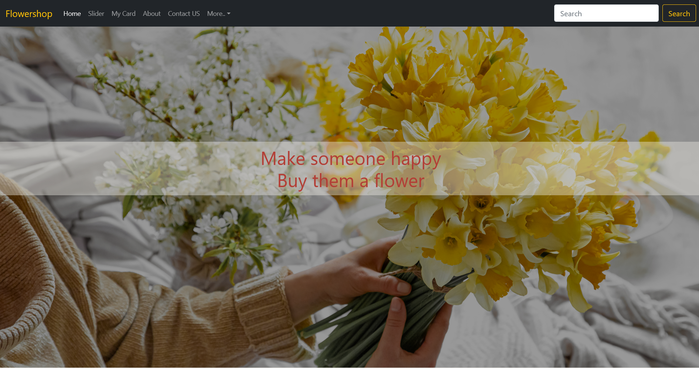
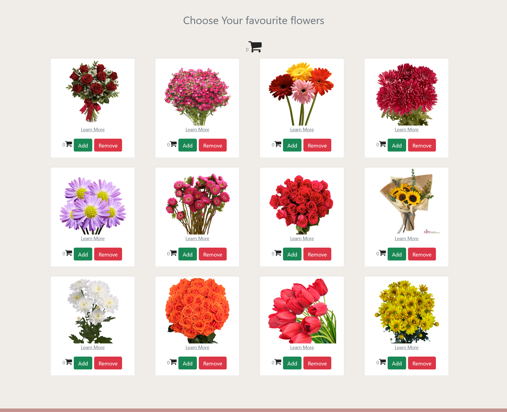
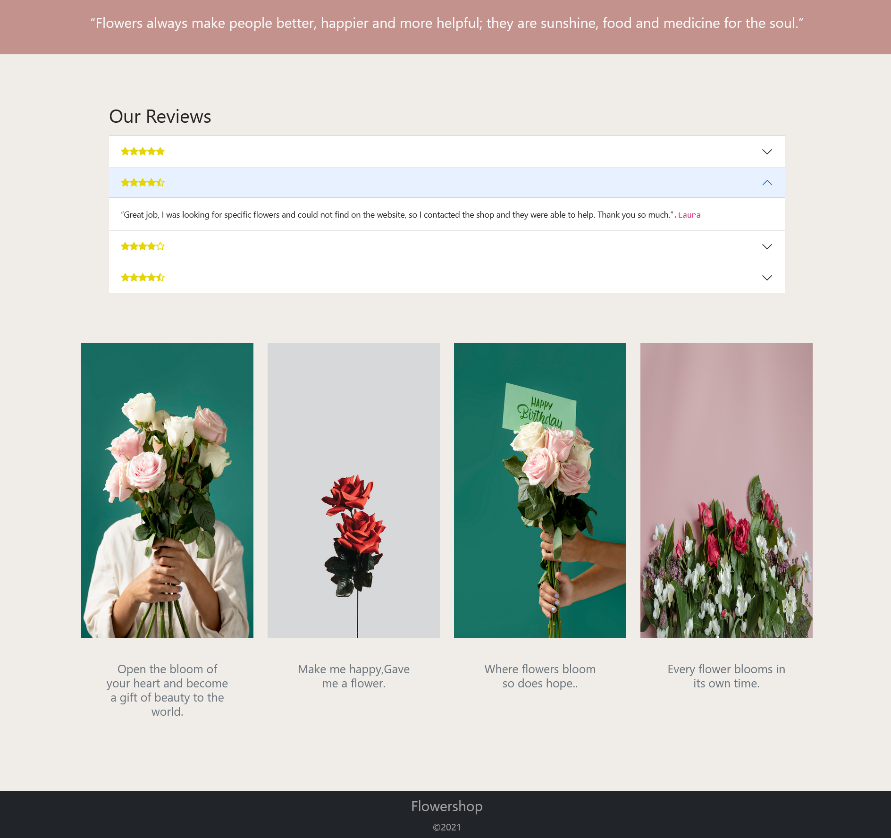
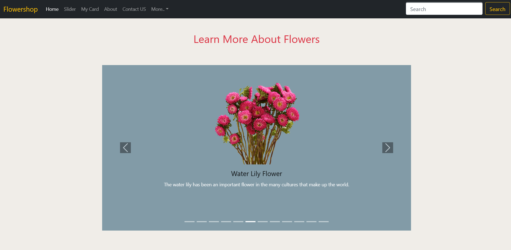
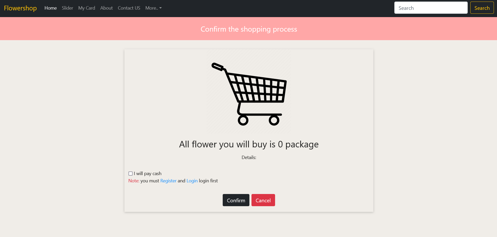
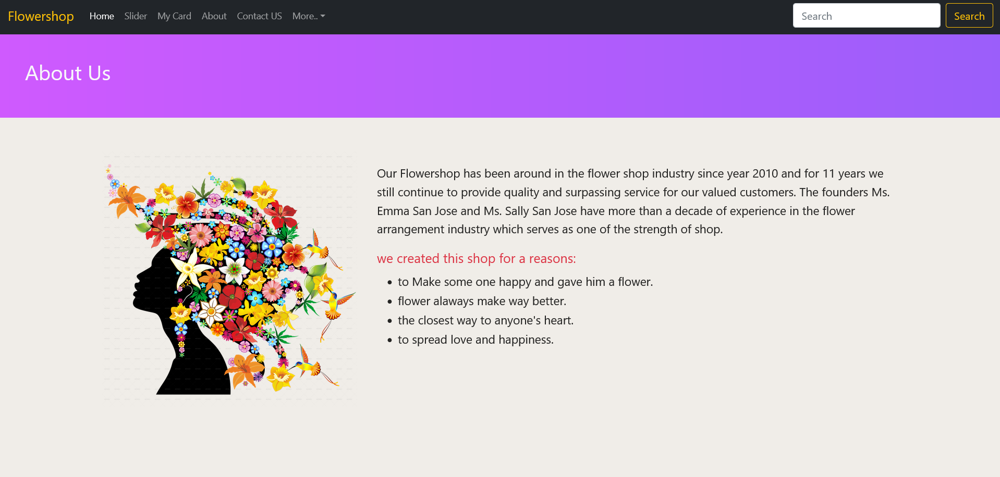
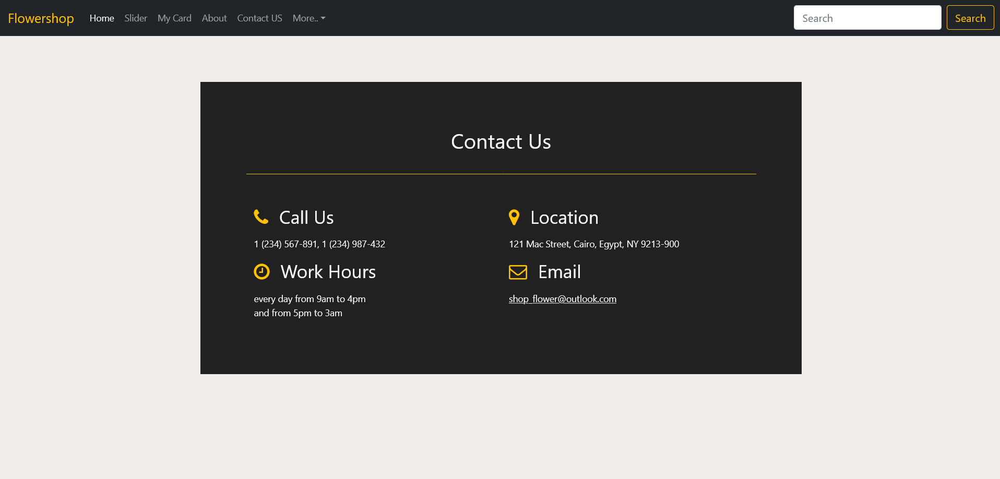

# Flower Shop App

This project is a Flower Shop web application built using React. It allows users to browse and purchase various types of flowers online. The application is the final project for the 1-month training at iti.

## Features

- User registration and authentication
- Browse different categories of flowers
- Add flowers to the shopping cart
- View and update the shopping cart
- Get informations about each flower

## Screenshots

### Home Page



### Flower Categories



### Customers Reviews



### Flower Details



### Shopping Cart



### About US



### Contact US



## Technologies Used

- React
- React Router (for routing)
- Axios (for API requests)
- Bootstrap (for styling)

## Getting Started

### Installation

1. Clone the repository:

   ```bash
   git clone https://github.com/your-username/flower-shop-app.git
   ```

2. Navigate to the project directory:

   ```bash
   cd flower-shop-app
   ```

3. Install the dependencies:

   ```bash
   npm install
   ```

4. Start the development server:

   ```bash
   npm start
   ```

5. Open your browser and visit `http://localhost:3000` to view the app.

## Project Structure

The project follows a standard React project structure:

- `src/`: Contains the source code files.
  - `components/`: Contains reusable UI components.
  - `main-component-page/`: Contains the main page components.
  - `App.js`: The main application component.
  - `index.js`: Entry point of the application.
- `public/`: Contains the static assets and index.html file.

## Acknowledgments

I would like to thank ITI for providing the training and giving me the opportunity to work on this project.

made in 2021
